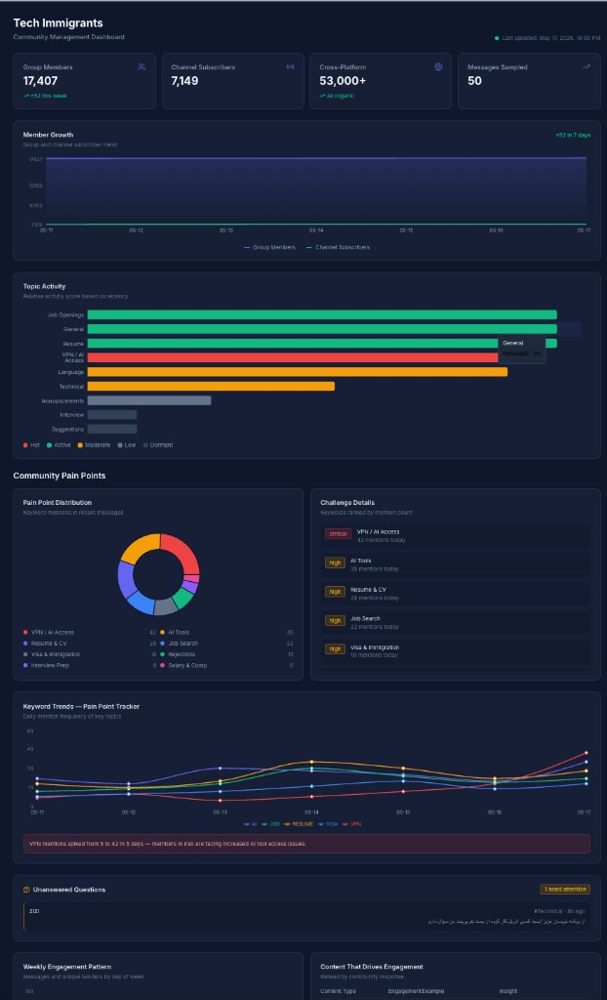

# Tech Immigrants — Community Dashboard

> Real-time analytics dashboard for managing a 17K+ member tech community, powered by automated data pipelines.

**[Live Demo](https://ti-community-dashboard.pages.dev)**



---

## The Problem

Managing a 17,000+ member Telegram community manually doesn't scale. Which topics need attention? What are members struggling with this week? Are we growing? Which content drives engagement? Without data, community decisions are guesswork.

## The Solution

An automated dashboard that pulls live data from Telegram, analyzes community patterns, and surfaces actionable insights — so I can spend time helping members instead of counting messages.

## Screenshots

| Member Growth & KPIs | Pain Point Detection |
|:---:|:---:|
| Tracks daily member count, channel subs, cross-platform reach | Bilingual keyword monitoring (Persian + English) detects emerging issues |

| Topic Activity Heatmap | Keyword Trends |
|:---:|:---:|
| Auto-ranks forum topics by recency and engagement | Visualizes how community concerns shift day-over-day |

## Architecture

```
Daily at 6:00 AM
  → n8n workflow calls Telegram Bot API (6 parallel requests)
  → Collects: member count, topic activity, messages, admin list
  → Transforms: keyword analysis, activity scoring, trend calculation
  → Commits JSON to GitHub
  → Cloudflare Pages auto-deploys
  → Dashboard live with fresh data in ~2 minutes
```

## Features

- **KPI Tracking** — member count, subscriber growth, cross-platform reach with trend indicators
- **Topic Activity Scoring** — auto-ranks 9 forum topics by engagement recency (hot/active/dormant)
- **Pain Point Detection** — bilingual keyword matching (Persian + English) identifies what members struggle with
- **Keyword Trend Charts** — visualize how community concerns shift over time (e.g., VPN mentions spiked 8x in 5 days)
- **Unanswered Question Alerts** — surfaces messages with no replies so admins can jump in
- **Content Performance Analysis** — which content types drive the most engagement
- **Growth Levers** — identifies underutilized platforms and expansion opportunities
- **Monetization Readiness** — tracks demand vs. execution readiness for revenue streams
- **Admin Team Overview** — who's active, role suggestions, delegation planning

## Tech Stack

| Layer | Technology |
|-------|-----------|
| Frontend | React 19, TypeScript, Tailwind CSS 4 |
| Charts | Recharts |
| Icons | Lucide React |
| Build | Vite 8 |
| Pipeline | n8n (workflow automation) |
| Data Source | Telegram Bot API |
| Hosting | Cloudflare Pages |
| CI/CD | GitHub Actions |

## Data Pipeline

The n8n workflow (`n8n/community-stats-workflow.json`) runs daily and:

1. Calls 6 Telegram Bot API endpoints in parallel
2. Runs a Code node that:
   - Parses member counts from group + channel
   - Extracts admin list
   - Scans recent messages with bilingual regex patterns for keyword tracking
   - Computes topic activity scores
3. Commits results to GitHub as structured JSON
4. Cloudflare Pages auto-deploys on push

### Keyword Detection (Bilingual)

Tracks these categories across Persian and English:

| Keyword | Patterns Matched |
|---------|-----------------|
| VPN | vpn, فیلتر, شکن, proxy, تحریم |
| Resume | resume, رزومه, cv, cover letter, کاور لتر |
| AI | ai, هوش مصنوعی, claude, chatgpt, cursor, gemini |
| Visa | visa, ویزا, اقامت, مهاجرت |
| Job | job, استخدام, شغل, کار |

## Project Structure

```
├── src/
│   ├── components/          # Dashboard UI components
│   ├── hooks/useData.ts     # Data loading from JSON snapshots
│   ├── types.ts             # TypeScript interfaces
│   └── App.tsx              # Main layout
├── data/
│   ├── snapshot-latest.json # Current state (read at build time)
│   └── history/             # Daily archives for trend analysis
├── n8n/
│   └── community-stats-workflow.json  # Importable n8n workflow
├── docs/
│   └── n8n-dashboard-setup.md         # Setup guide
└── .github/workflows/
    └── deploy.yml           # Auto-deploy to Cloudflare Pages
```

## Getting Started

```bash
# Development
npm install
npm run dev

# Build
npm run build

# Deploy (requires wrangler auth)
npm run deploy
```

## Context

This dashboard is part of the [Tech Immigrants](https://t.me/techimmigrants) platform — a community of 53K+ followers across platforms, built from zero over 6 years with zero paid promotion. The community helps tech professionals navigate immigration and career transitions.

## License

MIT
